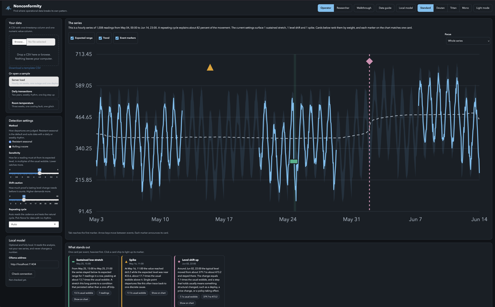

# Nonconformity

<!-- Badges follow the usual R project convention: language, license, status. -->
[](https://www.r-project.org/)
[](https://shiny.posit.co/)
[](LICENSE.md)

Find where operational data breaks its own pattern.

Nonconformity is an open source R Shiny app for reviewing operational time
series such as server load, transaction counts, or sensor readings. It learns
the ordinary rhythm of a series with classical, transparent statistics and
points at the moments that break it: spikes, dips, sustained runs, and lasting
level shifts. Every flag comes with a plain language reading built from the
numbers alone. Nothing leaves your computer.

The app serves two audiences from one screen. An operator sees plain charts,
plain readings, and a few honest controls. A researcher sees the same data
with the method internals exposed: the raw scores, the choice of detector, and
the exact call that reproduces a run.

## Screenshot



## Detection methods

Several methods share one event schema, so the chart, the reading cards, and
the optional local model stay method agnostic. The method selector switches
between them.

- **Resistant seasonal** (default). A running median trend, stacked seasonal
  medians, and binary segmentation for level shifts. Medians resist the very
  outliers the app hunts, and per segment offsets fold into the expected line
  so a step never sprays false spikes after it.
- **Rolling z-score.** A trailing median center and a trailing median absolute
  deviation spread, with no seasonal assumption. Fast to react, and a useful
  contrast that shows why a seasonal aware method is the right default for
  rhythmic data.
- **STL remainder.** Seasonal and trend decomposition by loess from base R,
  tagging the remainder where it leaves an interquartile fence. It needs a
  defined cycle and falls back to the resistant method when none applies.

## The optional local model

A language model running on your own machine can work on top of the analysis.
It reads the analysis summary and the event list, never your raw readings, and
never changes a number. It can summarize the whole run and say what matters
first, add a cause note to each event card, answer typed questions about the
loaded data in a chat panel, and draft an incident writeup you can copy into a
ticket. The Local model guide inside the app covers installing Ollama, pulling
a model, and the tradeoffs among four options.

## Getting started

```
R -e "shiny::runApp('nonconformity')"
```

Requires R with shiny, dplyr, tidyr, purrr, readr, tibble, and lubridate.
Open the printed address in a browser, then open a sample from the left
column or drop in a CSV.

## Data shape

A plain CSV with two columns. The timestamp column may be named stamp,
timestamp, time, date, datetime, or ds and holds ISO dates or datetimes at any
regular cadence. The value column may be named value, y, count, load, amount,
or measure and holds plain numbers. Ten readings is the floor and a few full
cycles work far better. A template is available under the upload box.

## Accessibility

Dark and light themes, four color vision palettes including monochrome, and
contrast checked at WCAG 2.2 level 4.5 to 1 across all eight theme and palette
combinations by an automated audit. Each palette moves the accent, the focus
ring, and all four event colors, so switching is unmistakable. Event types
carry their meaning by marker shape as well as color. Every marker is keyboard
reachable with arrow key movement between events and spoken announcements
through a live region. Touch targets meet the 44 pixel floor and motion honors
the reduced motion preference.

## Tests

```
sh nonconformity/tests/run_all.sh
```

The gate runs the engine suite against planted events in the samples and
across every method, the contrast audit, the writing sweeps, DOM level
rendering checks under jsdom, and a live boot of the app.

## Colophon

Nonconformity is written in [R](https://www.r-project.org/) and built on
[Shiny](https://shiny.posit.co/). The detection engine uses base R only:
`stats::runmed` for the trend, `stats::stl` for the loess decomposition, and
a hand written binary segmentation for level shifts. Data handling uses the
tidyverse packages listed above. The chart is hand built SVG with no plotting
library, so every mark is inspectable and the accessibility layer is part of
the drawing rather than a wrapper around it.

Tested against R 4.3 on Linux. Please report the output of `sessionInfo()`
with any bug report.

## Citation

If this software supports published work, please cite it. `CITATION.cff` in
the repository root carries machine readable metadata, and GitHub renders a
"Cite this repository" control from it.

## License

PolyForm Noncommercial License 1.0.0. See LICENSE.md.

Noncommercial use is permitted, which under these terms explicitly includes
use by charitable organizations, educational institutions, public research
organizations, and government institutions, regardless of funding source.
